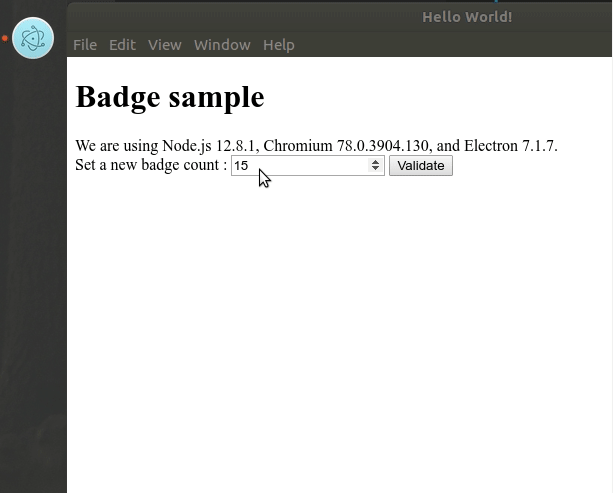
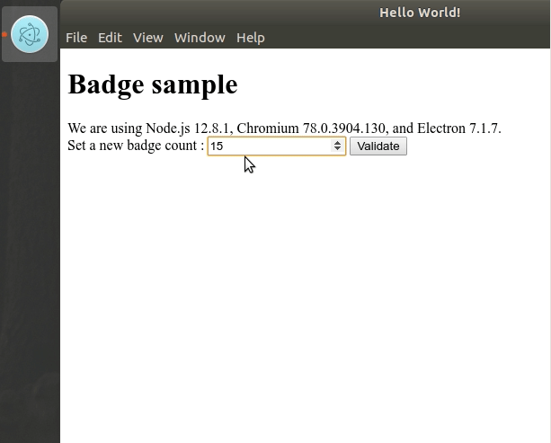

# Badges sample

Simple sample to use (app.badgeCount)[https://electronjs.org/docs/api/app#appbadgecount-linux-macos]

## Clone and run

## To Use

To clone and run this repository you'll need [Git](https://git-scm.com) and [Node.js](https://nodejs.org/en/download/) (which comes with [npm](http://npmjs.com)) installed on your computer. From your command line:

```bash
# Clone this repository
git clone https://github.com/famaridon/badges-sample.git
# Go into the repository
cd badges-sample
# Install dependencies
npm install
# Run the app
npm run dist
```
This will produce 2 files :

* dist/badges-sample_1.0.0_amd64.deb
* dist/badges-sample_1.0.0_amd64.snap

### Work fine with deb

```bash
# install deb file
dpkg -i dist/badges-sample_1.0.0_amd64.deb

# run application
badges-sample
```

set a new count the dock display badge count.



```bash
# uninstall 
apt remove badges-sample
```

### Fail with snap

```bash
# install snap file
snap install dist/badges-sample_1.0.0_amd64.snap --dangerous

# run application
badges-sample
```

set a new count and the dock will not display badge count.



```bash
# uninstall snap
snap remove badges-sample
```

## License

[CC0 1.0 (Public Domain)](LICENSE.md)
